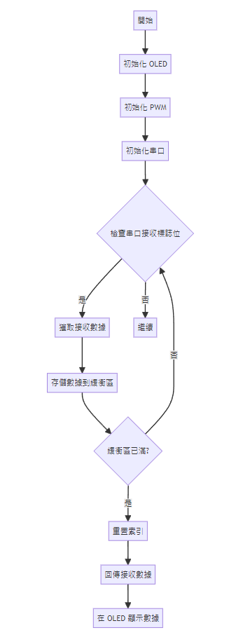

# 利用串口接收數據並在 OLED 顯示屏上顯示

## 目的
開發嵌入式軟體，通過串口接收數據並在 OLED 顯示屏上顯示。使用 C 語言實現串口通信和 OLED 顯示，測試和調試數據接收和顯示功能，確保數據的正確接收和顯示。

## 流程說明
### 系統初始化
1. 初始化步驟：
- 初始化 OLED 顯示屏。
- 初始化 PWM 模塊。
- 初始化串口通信，設置波特率、使能發送和接收功能，並配置中斷。
### 主循環
在主循環中檢查是否有串口數據接收，並將接收到的數據存儲在緩衝區中。如果接收到完整的數據包（AA BB CC），將其顯示在 OLED 上，並通過串口回傳接收的數據。
### 流程圖

## 流程總結
1. 初始化步驟：
初始化 OLED 顯示屏。
初始化串口通信，設置波特率、使能發送和接收功能，並配置中斷。

2. 數據接收與顯示：
在主循環中，不斷檢查串口接收標誌位。
當接收到數據時，將數據存儲在緩衝區中。
當接收到完整的數據包後，將數據顯示在 OLED 上，並通過串口回傳接收的數據。